# ggshroom

Tiny companion to [`ggimage`](https://github.com/YuLab-SMU/ggimage) for plotting fungal and fungus-like icons in `ggplot2`.

`ggshroom` depends on `ggimage` internally and wraps `ggimage::geom_image()` with a simple fungus-friendly interface.

___

## Installation

```r
if (!requireNamespace("devtools", quietly = TRUE)) {
  install.packages("devtools")
}

devtools::install_github("gzahn/ggshroom")
```

`ggimage` will be installed automatically as a package dependency.

___

## Citation

If you use `ggshroom` in a publication or public project and feel like citing it:

[](https://doi.org/10.5281/zenodo.20561468)

## Example usage

```r
library(ggplot2)
library(ggshroom)
# ggshroom uses ggimage::geom_image() under the hood

set.seed(1)

df <- data.frame(
  x = rnorm(50),
  y = rnorm(50),
  shroom = sample(list_shrooms(), 50, replace = TRUE)
)

ggplot(df, aes(x, y)) +
  geom_shroom(aes(image = shroom), size = 0.08) +
  theme_minimal()
```

You can also use a single fixed icon:

```r
ggplot(df, aes(x, y)) +
  geom_shroom(image = "yeastbud", size = 0.08) +
  theme_minimal()
```

___

## Available icons

Use `list_shrooms()` to see the bundled icon names, or browse the gallery below.

| Name | Icon |
| --- | --- |
| amanita | 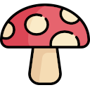 |
| amf |  |
| black |  |
| blue | 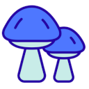 |
| brown | 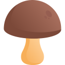 |
| chicken |  |
| chytrid |  |
| enoki |  |
| fusarium | 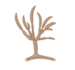 |
| morel | 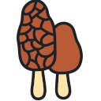 |
| neurospora |  |
| physarum | 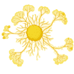 |
| purple | 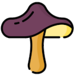 |
| rhizopus | 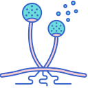 |
| schizo | 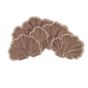 |
| shiitake | 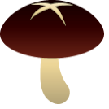 |
| white | 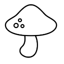 |
| yeast1 | 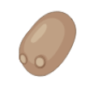 |
| yeastbud | 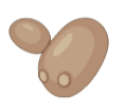 |
